# 로봇 액션 포지션/모션 시퀀스 수정·테스트 가이드

기준일: 2026-03-20

이 문서는 최근 반영된 모션/포지션 UI 업데이트를 기준으로,  
`로봇 액션 포지션 설정`에서 값을 수정하고 실제 시퀀스를 검증하는 절차를 정리합니다.

## 0. 엔지니어 필독(최우선): 모션 수정 핵심 맵

모션 시퀀스를 실제로 바꾸려면 아래 3개 파일의 특정 섹션을 우선 다룹니다.

### 0.1 시작/중간/끝을 어디서 수정하나

- 시작(Start) 구간
  - 파일: `src/bartender_action/robot_action_planner.py`
  - 주로 수정할 함수:
    - `_append_start_sequence(...)` (시퀀스 시작 공통 동작)
    - `_append_ingredient_sequence(...)` 내 `[1] PICK/준비` 블록
- 중간(Middle) 구간
  - 파일: `src/bartender_action/robot_action_planner.py`
  - 주로 수정할 함수:
    - `_append_ingredient_sequence(...)` 내
      - `[1] PICK`
      - `[2] POUR`
      - `[3] RETURN`
    - `_execute_live_volume_feedback_pour_sequence(...)` (실시간 용량 피드백 pour)
- 끝(End) 구간
  - 파일: `src/bartender_action/robot_action_planner.py`
  - 주로 수정할 함수:
    - `_append_finish_sequence(...)` (현재 기본코드에서는 시작 로그만 남기고 CUP PICK/DELIVERY 모션 블록이 주석 처리됨)
    - `run_robot_action(...)` 마지막 단계 조합(전체 조립 순서)

### 0.2 UI와 모션 연결을 어디서 맞추나

- 파일: `src/frontend/developer_frontend.py`
- 주로 수정할 함수:
  - `_build_liquid_robot_action_pose_rows(...)` (소주/맥주 표 항목)
  - `_build_glass_robot_action_pose_rows(...)` (글라스 표 항목)
  - `_open_robot_action_pose_dialog(...)` (클릭/하이라이트/편집/이동 동작)

즉, planner에서 시퀀스를 바꿨으면 반드시 UI row 정의도 같이 맞춰야 합니다.

### 0.3 실제 실행 게이트(안전/초기화) 수정 위치

- 파일: `src/backend/task_backend_node.py`
- 주로 수정할 함수:
  - `run_bartender_first_ingredient_action(...)` (실행 진입점)
  - `_ensure_gripper_ready_before_sequence(...)` (실행 전 그리퍼 준비 확인)
  - `_execute_bartender_robot_action_native(...)`, `_execute_planner_sequence_steps(...)` (실행/계획 분기)

### 0.4 수정 우선순위 권장

1. `robot_action_planner.py`에서 시작/중간/끝 동작을 먼저 수정
2. `developer_frontend.py`에서 액션 포지션 표/참조행/순서 표기를 동기화
3. `task_backend_node.py`에서 실행 게이트(그리퍼/안전/계획모드) 영향 확인

### 0.5 변경/유지/삭제 정합성 체크 (현재 기준)

- 변경된 부분
  - 액션 포지션 UI: 소주/맥주/글라스 탭 분리, 타입 축약 표기, 행/동일변수 하이라이트
  - 시퀀스 표기: RETURN 역순 참조행 확장, 글라스 DELIVERY 이탈 항목 추가
  - 실행 전 검증: 시퀀스 시작 시 그리퍼 준비 확인(필요 시 재초기화)
- 유지된 부분
  - 실제 모션 실행 진입점은 `run_bartender_first_ingredient_action(...)` 유지
  - 시퀀스 API 엔드포인트(`/api/sequence/start|stop|state`) 유지
  - 런치/기본 실행 흐름(`run_bartender.py`) 유지
- 없어지거나 정리된 부분
  - 액션 포지션 표의 `수정` 버튼 제거(값 셀 클릭 수정 방식)
  - `값클릭수정`, `이동전용`, `보기` 텍스트 라벨 제거
  - `(return_ref)` 텍스트 표기 제거(동일 변수 표시 기준으로 통일)
  - 그리퍼 오픈/파지 결합 행(`gripper_actions` UI 행) 제거, 단일 액션 행으로 분리

### 0.6 현재 코드 주의사항(실행 기준)

- `robot_action_planner.py`의 `_append_finish_sequence(...)` 내부 CUP PICK/DELIVERY 실제 모션 라인은 현재 주석 처리 상태입니다.
- 따라서 기본 실행 경로에서 컵 전달 모션 단계(`[4] CUP PICK`, `[5] DELIVERY`)는 실제 로봇 step으로 내려가지 않습니다.
- 개발자 UI의 글라스 탭 항목은 편집/이동 검증용으로 유지되며, planner 실행 반영은 별도 활성화가 필요합니다.

## 1. 전체 업데이트 요약

### 1.1 액션 포지션 UI 구조

- 재료 탭 분리: `소주(soju)`, `맥주(beer)`, `글라스잔(glass)`
- 타입 컬럼 축약 표기: `posj`, `posx`, `v_target`, `v_offset`, `g_open`, `g_close` 등
- 테이블 클릭 UX:
  - 행 클릭 시 가로행 전체 하이라이트
  - 같은 탭 내에서 같은 변수명(`var_name`)을 참조하는 행도 같이 하이라이트
- `return_ref` 표기 제거:
  - 변수명 컬럼에서는 `(return_ref)`를 숨김
  - 같은 값을 쓰는 항목은 동일 변수로 보이도록 정리

### 1.2 시퀀스 항목 정리

- 소주/맥주:
  - `service_ready_posj`는 상단 기준값 1개를 유지(수정/티칭 가능)
  - PICK 구간 그리퍼 파지 순서를 접근/파지 위치 뒤로 정리
  - RETURN 구간에 `service_ready_posj` 참조 위치를 추가(복귀 준비/다음 재료 준비)
- 글라스잔:
  - DELIVERY 구간에 `전달 위치 이탈` 항목 추가
- 주의:
  - UI에는 글라스 CUP PICK/DELIVERY 항목이 정의되어 있지만,
  - 현재 planner 실행 경로에서는 `_append_finish_sequence(...)` 모션 블록이 주석 처리되어 실제 시퀀스에 포함되지 않습니다.
- 그리퍼 액션 행(오픈/파지):
  - 참조형(`reference_only`)으로 통일

### 1.3 참조형(Reference) 표시 정책

다음 항목은 “티칭 대상”이 아니라 “참고/실행 참조”로만 표시합니다.

- service_ready 참조 행(상단 기준값 행 제외)
- return 역순 참조 행
- 그리퍼 오픈/파지 액션 행

표시 규칙:

- `현재값`: `-`
- `설명`: `위치참조`
- `상태`: `참조`
- 동작 버튼: 이동/실행만 가능(티칭/값편집 없음)

### 1.4 실행 안정성/반응성 관련

- 실시간 pour 판정 파라미터(기본값):
  - `BARTENDER_LIVE_POUR_VOLUME_POLL_SEC=0.002`
  - `BARTENDER_LIVE_POUR_MIN_POLL_SEC=0.001`
  - `BARTENDER_LIVE_POUR_VOLUME_MAX_AGE_SEC=0.05`
- 시퀀스 실행 전 그리퍼 초기화 확인:
  - 실행 직전에 그리퍼 준비 상태를 확인하고 필요 시 재초기화 후 진행

## 2. 파일/설정 반영 경로

- 모션 포즈 저장 파일: `config/robot_action_pose_config.json`
- 메뉴별 보정 저장 파일: `config/menu_xyz_offsets.json`
- UI 진입 버튼: 개발자 UI 설정 패널의 `로봇 액션 포지션/재료 오프셋 설정`

## 3. 모션 시퀀스 수정 절차 (UI 기준)

### 3.1 설정창 열기

1. 개발자 UI 실행
2. 설정 패널에서 `로봇 액션 포지션/재료 오프셋 설정` 클릭
3. 팝업 창 제목 `로봇 액션 포지션 설정` 확인

> [스크린샷-01 삽입] 설정 패널에서 액션 포지션 버튼 위치  

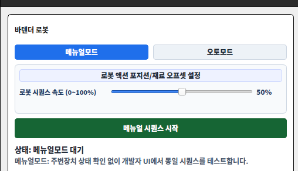

> [스크린샷-02 삽입] `로봇 액션 포지션 설정` 창 전체(탭/컬럼 포함)

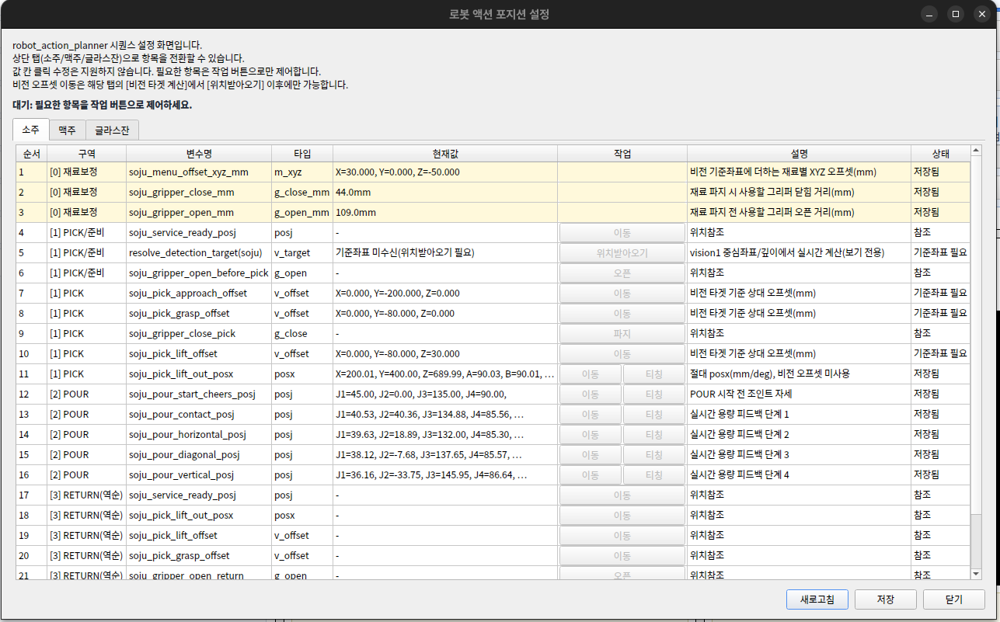

### 3.2 탭/행 의미 확인

1. `소주`, `맥주`, `글라스잔` 탭 중 대상 재료 탭 선택
2. 컬럼 확인:
   - `순서`, `구역`, `변수명`, `타입`, `현재값`, `작업`, `설명`, `상태`
3. 참조형 행 확인:
   - `현재값 = -`, `설명 = 위치참조`, `상태 = 참조`

> [스크린샷-03 삽입] 참조형 행 예시(service_ready, gripper action, return 참조행)

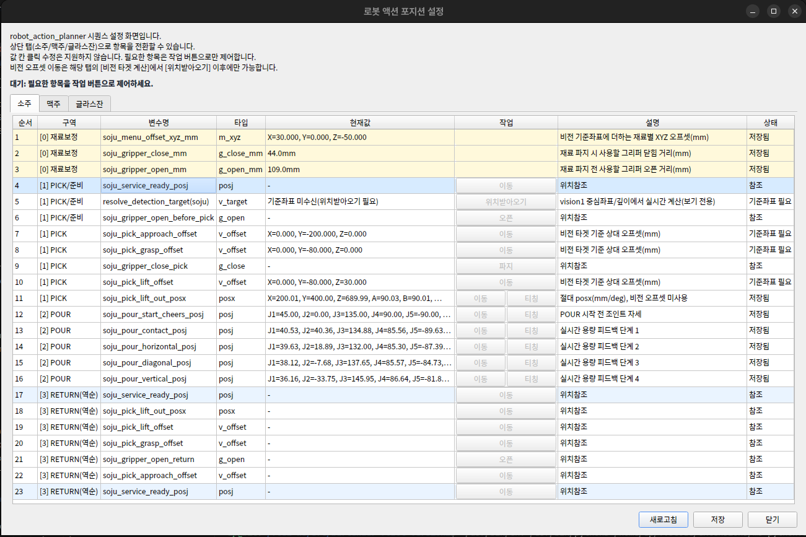

### 3.3 값 수정(티칭) 가능한 행 작업

수정 가능한 대표 항목:

- `posj`, `posx` (참조형이 아닌 행)
- `vision_offset`
- `[0] 재료보정`의 재료별 오프셋/그리퍼 mm

수정 방법:

1. `현재값` 셀 클릭 -> 값 입력 다이얼로그에서 수정
2. `티칭` 버튼이 있는 `posj/posx`는 실제 현재 로봇 위치를 반영 가능
3. `이동` 버튼으로 목표 위치 이동 검증

> [스크린샷-04 삽입] 값 클릭 수정 다이얼로그(posj 또는 posx)  
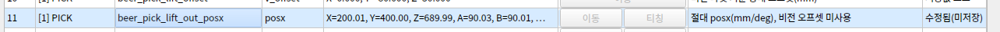

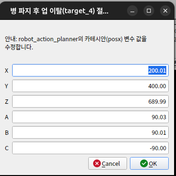

> [스크린샷-05 삽입] 티칭 버튼 사용 예시  
> [스크린샷-06 삽입] 이동 확인 팝업과 실행 후 상태 표시

### 3.4 같은 변수 참조 행 확인

1. 특정 행 클릭
2. 같은 탭에서 같은 변수명을 쓰는 다른 행이 함께 하이라이트되는지 확인
3. RETURN 역순 참조행에서 동일 변수 연동 표시 확인

> [스크린샷-07 삽입] 같은 변수명 행 동시 하이라이트 예시

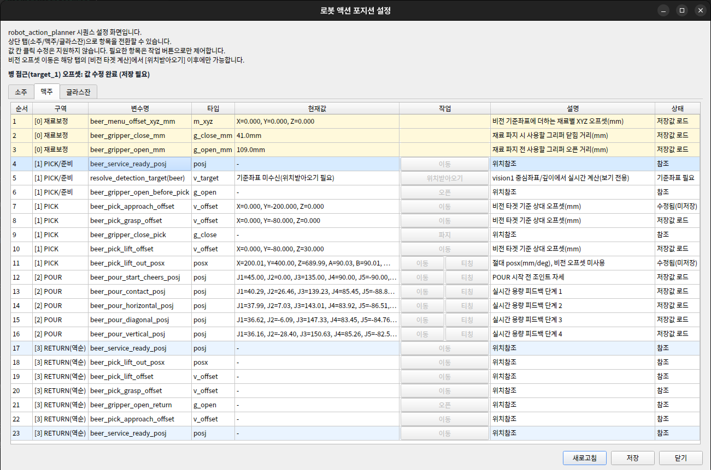
### 3.5 저장

1. 창 하단 `저장` 버튼 클릭
2. 상태 문구에 저장 경로가 표시되는지 확인
3. 필요 시 `새로고침`으로 저장값 재로드 확인

> [스크린샷-08 삽입] 저장 성공 상태 메시지 및 로그

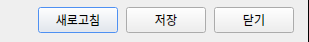

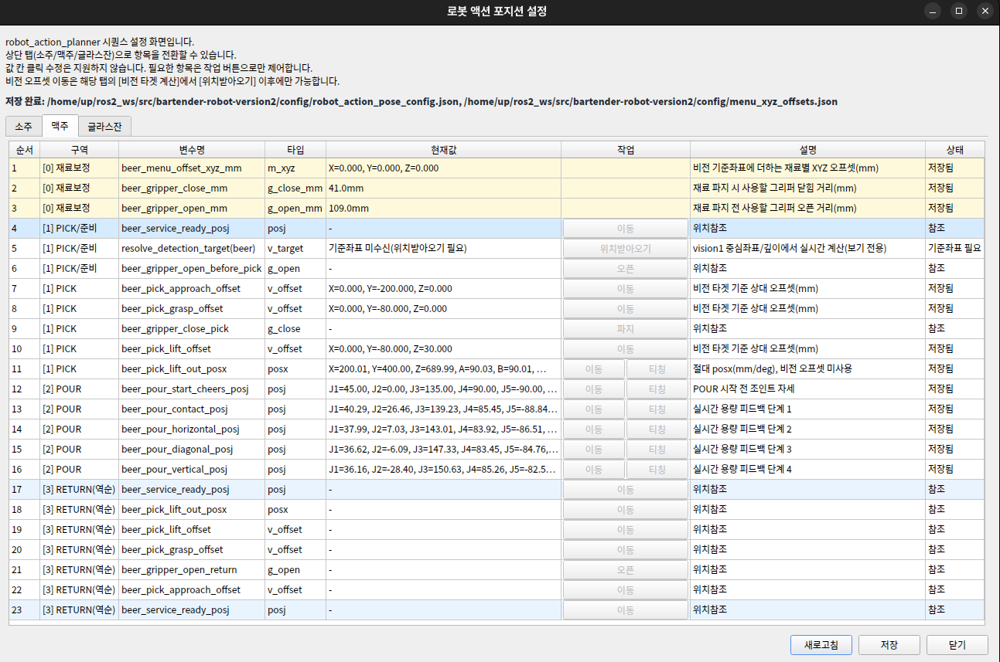

## 4. 모션 시퀀스 테스트 절차

### 4.1 사전 점검

1. 로봇 모드/통신 상태 정상
2. vision1/vision2 메타 토픽 수신 정상
3. 안전 위치/툴/TCP 확인
4. 코드 문법 점검:

```bash
python3 -m py_compile src/frontend/developer_frontend.py
python3 -m py_compile src/backend/task_backend_node.py
python3 -m py_compile src/bartender_action/robot_action_planner.py
```

### 4.2 계획 검증(API 옵션 기반)

현재 코드 기준 주의사항:

- 개발자 UI에는 별도 계획모드 토글/버튼이 없습니다.
- 개발자 UI에서 시퀀스 시작 시 `execute_robot_action=True`가 명시 전달됩니다.
  - `src/frontend/developer_frontend.py`의 시퀀스 시작/단독테스트 요청 참고
- 즉, UI 기본 동작은 실동작(실행모드)입니다.

참고:
- 계획 검증이 필요하면 `/api/sequence/start` 요청에 `execute_robot_action=false`를 명시해 호출합니다.
- `BARTENDER_ROBOT_ACTION_EXECUTE`는 `execute_enabled_override`가 없는 호출에서만 fallback으로 사용됩니다.

검증 포인트:

- 실제 모션 없이 계획 로그가 생성되는지
- 단계 로그 순서(현재 기본: PICK -> POUR -> RETURN)
- `[glass] 완성컵 처리 시퀀스 시작` 로그만 남고 CUP PICK/DELIVERY 모션 step은 생성되지 않는지
- 재료별 포즈/오프셋 로딩 여부

> [스크린샷-09 삽입] 계획 검증(`execute_robot_action=false`) 로그

### 4.3 Real-run(실기 동작 검증)

실제 동작 검증 시:

```bash
python3 run_bartender.py robot_mode:=real robot_host:=<ROBOT_IP> robot_model:=e0509
```

권장 검증 순서:

1. 단일 재료(소주) 테스트
2. 단일 재료(맥주) 테스트
3. 다중 재료(소맥) 테스트
4. (선택) `_append_finish_sequence(...)` 모션 블록 활성화 후 글라스 전달 동작 테스트

검증 포인트:

- 시퀀스 시작 전 그리퍼 초기화 확인 로그
- PICK/POUR/RETURN 각 단계 도달 여부
- 현재 코드 기준으로 글라스 DELIVERY 실동작이 실행되지 않는 상태(주석 처리)를 로그로 확인
- 목표 용량 도달 시 정지/복귀 응답

> [스크린샷-10 삽입] Real-run 시작 전 그리퍼 초기화 성공 로그  
> [스크린샷-11 삽입] 단계별 진행 로그(PICK/POUR/RETURN)  
> [스크린샷-12 삽입] (선택) 글라스 DELIVERY(릴리즈 후 이탈) 로그

### 4.4 문제 발생 시 점검

- 시퀀스 시작 실패:
  - 비전 메타 stale 여부
  - CameraInfo 수신 여부
  - 그리퍼 초기화 에러 메시지
- 위치 오차:
  - `menu_xyz_offsets` 및 `vision_offset` 값 재검증
  - 참조행이 아닌 실제 편집 대상 행 수정 여부 확인
- pour 응답 지연:
  - `BARTENDER_LIVE_POUR_*` 파라미터 확인
  - vision2 지연(`VISION2_META_STALE_SEC`) 확인

### 4.5 모션동작 단독 테스트 기능 (로봇동작만)

개발자 UI에는 음성/LLM 없이 로봇동작 단계만 확인하는 단독 테스트 기능이 있습니다.
이 기능에도 비전 확인 단계가 포함되므로, 테스트 시 실제 물체(재료 병/컵)가 카메라 시야에 있어야 합니다.

동작 개요:

- 메뉴얼 모드에서만 사용 가능
- 테스트 메뉴(소주/맥주/소맥)를 선택해 실행
- 내부 요청은 `robot_action_only=true`로 전달되어
  - `voice_request`, `stt`, `llm`, `recipe` 단계는 완료 처리
  - `robot_action -> vision_check -> done` 중심으로 진행

UI 절차:

1. 개발자 UI에서 모드를 `메뉴얼`로 설정
2. `로봇동작 단독 테스트` 버튼 클릭
3. 메뉴 선택 다이얼로그에서 테스트 메뉴 선택
4. 확인 팝업에서 실행 승인
5. 로그/상태에서 `로봇동작 단독 테스트 시작/완료` 확인

검증 포인트:

- 메뉴얼 모드가 아닐 때 차단되는지
- 시퀀스 실행 중 중복 시작이 차단되는지
- 현재 기본코드 기준으로 PICK/POUR/RETURN까지만 진행되는지
- 글라스 DELIVERY 검증은 `_append_finish_sequence(...)` 활성화 이후 별도 확인
- 단독 테스트 완료 후 시퀀스 상태가 `done`으로 종료되는지

API 확인(선택):

- 단독 테스트는 `/api/sequence/start` 요청의 `request.robot_action_only=true`로도 동일하게 실행할 수 있습니다.
- 필요 시 `execute_robot_action=false`를 함께 보내 단독 테스트 계획 검증도 가능합니다.

> [스크린샷-13 삽입] 개발자 UI `로봇동작 단독 테스트` 버튼 위치  

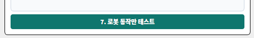

> [스크린샷-14 삽입] 메뉴 선택 다이얼로그(소주/맥주/소맥)  

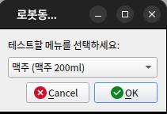

> [스크린샷-15 삽입] 단독 테스트 시작/완료 로그

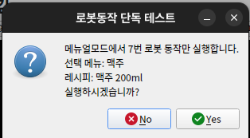

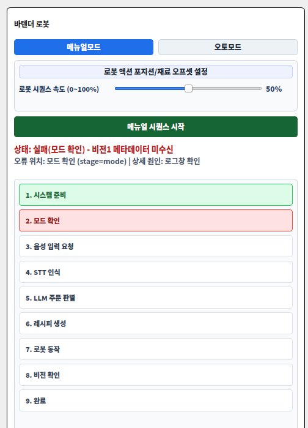


## 5. 스크린샷 삽입 목록

- 스크린샷-01: 설정 패널 버튼 위치
- 스크린샷-02: 액션 포지션 창 전체
- 스크린샷-03: 참조형 행 표시 예시
- 스크린샷-04: 값 클릭 수정 다이얼로그
- 스크린샷-05: 티칭 버튼 사용
- 스크린샷-06: 이동 확인 팝업/실행
- 스크린샷-07: 동일 변수명 동시 하이라이트
- 스크린샷-08: 저장 완료 상태/로그
- 스크린샷-09: 계획 검증(`execute_robot_action=false`) 로그
- 스크린샷-10: 그리퍼 초기화 성공 로그
- 스크린샷-11: PICK/POUR/RETURN 단계 로그
- 스크린샷-12: (선택) 글라스 DELIVERY 로그(해당 모션 블록 활성화 후)
- 스크린샷-13: `로봇동작 단독 테스트` 버튼 위치
- 스크린샷-14: 단독 테스트 메뉴 선택 다이얼로그
- 스크린샷-15: 단독 테스트 시작/완료 로그
